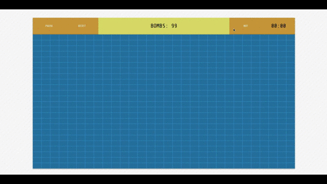

# Minesweeper
An Angular based implementation of the classic game Minesweeper. Uses Finite State Machines for state management. Has a built-in AI solver for the game.

## Demo
[https://aravindvasudev.github.io/Minesweeper/](https://aravindvasudev.github.io/Minesweeper/)

## Contribute
You are always welcome to open an issue or provide a pull-request!

## License
Built under [MIT](./LICENSE) license.